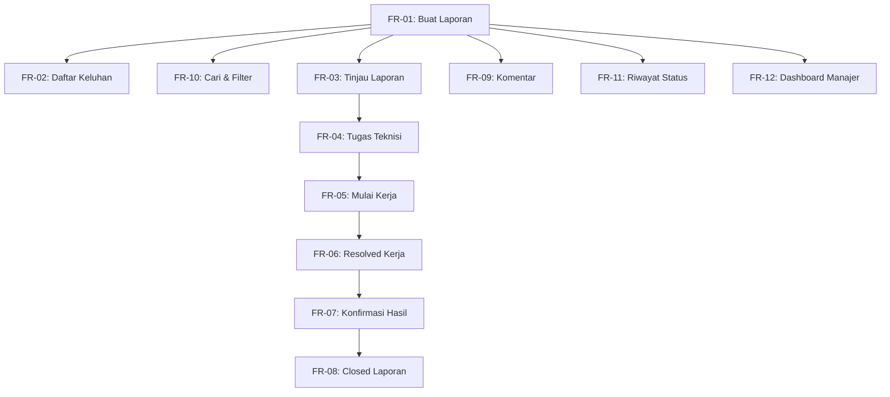

# Prioritization & Execution Plan
## Campus Service Request and Maintenance System

Dokumen ini mendefinisikan prioritas pengerjaan fungsional sistem menggunakan metode MoSCoW, pemetaan ketergantungan (dependencies), penilaian risiko teknis, dan urutan pengerjaan yang logis dalam rentang waktu pengerjaan 3-4 hari.

---

## 1. Klasifikasi MoSCoW (Fungsional Requirements)

Dari total 12 Functional Requirements (FR), pembagian prioritas diklasifikasikan sebagai berikut (dengan batasan Must Have &le; 60%):

### A. Must Have (Wajib - 7 FR / 58%)
*   **FR-01 (Membuat Laporan Baru)**: Tanpa input data laporan, tidak ada siklus kerja sistem.
*   **FR-02 (Melihat Daftar Keluhan Pribadi)**: Kebutuhan dasar pelapor untuk melacak tiketnya.
*   **FR-03 (Meninjau Laporan - Under Review)**: Validasi awal oleh Admin untuk menyaring spam.
*   **FR-04 (Menugaskan Teknisi - Assigned)**: Menghubungkan masalah dengan staf penyelesai.
*   **FR-05 (Mulai Pengerjaan - In Progress)**: Melacak kapan teknisi mulai bekerja secara aktif.
*   **FR-06 (Menandai Selesai - Resolved)**: Pencatatan penyelesaian masalah dan input solusi teknis.
*   **FR-08 (Menutup Laporan - Closed)**: Fase akhir tiket di mana status menjadi arsip (read-only).

### B. Should Have (Penting tapi Bisa Menyusul - 3 FR / 25%)
*   **FR-07 (Konfirmasi Hasil Perbaikan)**: Feedback pelapor penting untuk validasi kualitas perbaikan fisik, namun pengerjaan utama sudah selesai di level `Resolved`.
*   **FR-10 (Pencarian & Filter)**: Sangat penting bagi admin dan teknisi ketika tiket sudah berjumlah puluhan/ratusan, namun alur utama per tiket tidak terpengaruh secara langsung.
*   **FR-12 (Dashboard Manajer Fasilitas)**: Metrik analitis untuk pimpinan, tetapi tidak menghalangi operasional lapangan harian.

### C. Could Have (Nyaman Ditambahkan - 2 FR / 17%)
*   **FR-09 (Sistem Komentar Publik)**: Mempermudah komunikasi informal, namun koordinasi bisa dialihkan ke WhatsApp jika waktu pengerjaan proyek sangat mepet.
*   **FR-11 (Tabel Riwayat Status - Audit Trail)**: Meningkatkan transparansi dan audit trail, tetapi sekunder dibandingkan data status ter-update saat ini.

---

## 2. Peta Ketergantungan (Dependency Map)

Bagan berikut memetakan urutan ketergantungan antar-fitur. Fitur di sebelah kanan membutuhkan fitur di sebelah kiri selesai terlebih dahulu:

---

## 3. Penilaian Risiko Teknis (Technical Risk Assessment)

| ID | Kebutuhan Fungsional | Risiko | Tingkat Risiko | Alasan & Mitigasi |
| :--- | :--- | :--- | :--- | :--- |
| **FR-01** | Membuat Laporan Baru | Validasi Input | **Low** | Standar form React. Mitigasi: Validasi regex sederhana dan batasan panjang karakter di backend/frontend. |
| **FR-03** | Meninjau Laporan | State Management | **Medium** | Perubahan state harus sinkron antara DB D1 dan state React. Mitigasi: Pastikan API mengembalikan record terbaru setelah update. |
| **FR-04** | Menugaskan Teknisi | Konsistensi Data | **Medium** | Dropdown teknisi harus mengambil data dari tabel pengguna ber-role teknisi secara dinamis. Mitigasi: Seed awal data user role di migrasi SQL. |
| **FR-06** | Menandai Selesai (Resolved) | Database Lock / Integrity | **Medium** | Menuntut penulisan log status dan catatan penyelesaian secara bersamaan. Mitigasi: Gunakan SQLite Transaction di Workers API. |
| **FR-07** | Konfirmasi Perbaikan | Logika Percabangan | **Medium** | Alur status dapat kembali ke `Under Review` jika pelapor memilih "Tidak Setuju". Mitigasi: Definisikan transisi status secara eksplisit di kode Worker. |
| **FR-08** | Menutup Laporan (Closed) | Read-Only Lock | **High** | Memerlukan kunci (lock) sistem agar laporan `Closed` benar-benar aman dari manipulasi komentar/status. Mitigasi: Validasi ketat di API (cek status Closed sebelum eksekusi write). |
| **FR-12** | Dashboard Manajer | Efisiensi Agregasi SQL | **Medium** | Menghitung total data dinamis di Cloudflare D1. Mitigasi: Gunakan query SQL `COUNT` & `GROUP BY` yang optimal tanpa memuat seluruh baris data keluhan. |

---

## 4. Urutan Pengerjaan yang Direkomendasikan (Day 1 - Day 4)

Dengan batas waktu 3-4 hari untuk proyek individu, urutan pengerjaan direkomendasikan secara inkremental:

### Tahap 1: Pondasi Database & Integrasi Worker (Day 1)
1.  **FR-01 (Part 1 - Database)**: Deploy skema migrasi database D1 lokal.
2.  **FR-01 & FR-02 (API Backend)**: Buat endpoint `POST /api/requests` dan `GET /api/requests` di Worker.
    *   *Alasan*: Tanpa API penyimpanan dan pengambilan data dasar, frontend React tidak dapat dikembangkan secara fungsional.

### Tahap 2: Frontend & Simulator Role Utama (Day 2)
3.  **Dropdown Role Switcher**: Buat header simulator peran untuk mempermudah beralih antar aktor.
4.  **UI Pelapor (FR-01 & FR-02)**: Buat form pembuatan laporan (dilengkapi validasi judul min. 5, deskripsi min. 20) dan tabel daftar laporan.
5.  **UI Admin (FR-03 & FR-04)**: Buat list antrean keluhan bagi administrator dan tombol aksi "Tinjau" serta dropdown "Tugaskan Teknisi".
6.  **UI Teknisi (FR-05 & FR-06)**: Buat list penugasan per teknisi dan aksi tombol "Mulai Pengerjaan" & "Tandai Selesai" (wajib isi catatan perbaikan).

### Tahap 3: Penyempurnaan Alur Status & Validasi Bisnis (Day 3)
7.  **FR-07 & FR-08 (Konfirmasi & Closed)**: Implementasikan tombol konfirmasi pelapor dan penutupan final keluhan oleh admin di frontend dan backend.
8.  **Keamanan State (BR-05)**: Tambahkan proteksi read-only pada backend API untuk keluhan yang berstatus `Closed`.
9.  **FR-10 (Pencarian & Filter)**: Tambahkan filter status & kategori serta kotak pencarian teks di frontend untuk mempermudah navigasi data.

### Tahap 4: Fitur Pendukung, Dashboard, & Testing (Day 4)
10. **FR-11 & FR-09 (Riwayat Status & Komentar)**: Buat log perubahan status dinamis (linimasa) dan form input komentar teks di halaman detail laporan.
11. **FR-12 (Dashboard Manajer)**: Tambahkan panel Manajer Fasilitas yang menghitung agregasi statistik data langsung dari database D1.
12. **Automated Testing**: Jalankan seluruh unit & integration tests menggunakan Vitest untuk memverifikasi 100% fungsionalitas bebas error.

---

## 5. Konflik Prioritas dan Resolusi

*   **Konflik 1: Kecepatan Penyelesaian Tiket (Admin/Manajer) vs Akurasi Perbaikan (Pelapor)**
    *   *Deskripsi*: Admin ingin tiket cepat berstatus `Closed`, namun Pelapor ingin memverifikasi keluhan secara detail terlebih dahulu.
    *   *Resolusi*: Tiket berstatus `Resolved` tidak bisa langsung dipaksa menjadi `Closed` oleh admin tanpa adanya aksi konfirmasi "Setuju/Tidak Setuju" dari Pelapor, ATAU sistem otomatis melakukan transisi ke `Closed` secara aman jika pelapor tidak merespons setelah 3 hari `[ASUMSI]`.
*   **Konflik 2: Kedetailan Riwayat (Manajer) vs Kemudahan Input di Lapangan (Teknisi)**
    *   *Deskripsi*: Manajer Sarpras membutuhkan data histori status yang mendalam untuk pelacakan. Namun, teknisi di lapangan tidak ingin dipersulit dengan form isian yang panjang saat memperbarui progres.
    *   *Resolusi*: Status pengerjaan diperbarui dengan satu klik tombol aksi ("Mulai Kerja" / "Selesai"), dan sistem backend secara otomatis merekam data aktor, status sebelumnya, status baru, dan timestamp secara implisit ke dalam tabel `request_status_history` tanpa membebani teknisi untuk mengisi form tambahan secara manual (kecuali catatan penyelesaian akhir).
